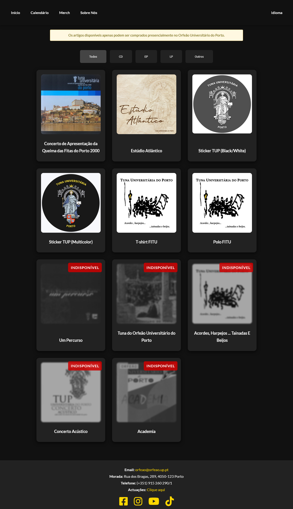
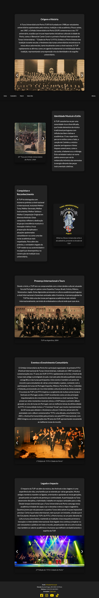

# Website_recreational

A **website template** built using HTML, CSS, and JavaScript.
This template includes features such as a **reactive calendar with event management**, **responsive navigation bar**, **image and video support**, **item catalog** among others.

## File Structure

Website_recreational/
│
├─ index.html # Main HTML file
├─ style.css # Stylesheet for layout and design
├─ script.js # JavaScript for calendar and interactions
├─ fonts/ # Folder containing custom fonts
├─ images/ # Images used in the project
└─ README.md # Project documentation

---

## Instalation

1. Clone the repository:

```bash
git clone https://github.com/FreddieAlvin/Website_recreational.git
```

2. Navigate into the project folder:

cd Website_recreational

3. Open main.html in your browser:

Mac/Linux Terminal:
open main.html

Windows Explorer:
Double-click main.html

Windows Command Prompt / PowerShell:
start main.html

---

## Screenshots

  

  


---

## License

This project is open-source and free to use for personal or educational purposes.  
You are welcome to modify, share, and use it, but please give appropriate credit.

---

## Contributing

Contributions are welcome! You can help by:

- Reporting bugs or issues  
- Suggesting new features  
- Submitting pull requests with improvements  

Please make sure your code follows the existing style and is well-documented.

---

## Future Improvements

Some ideas for future updates:

- Fully integrated database
- Improve mobile responsiveness for smaller screens  
- Implement a dark/light mode toggle